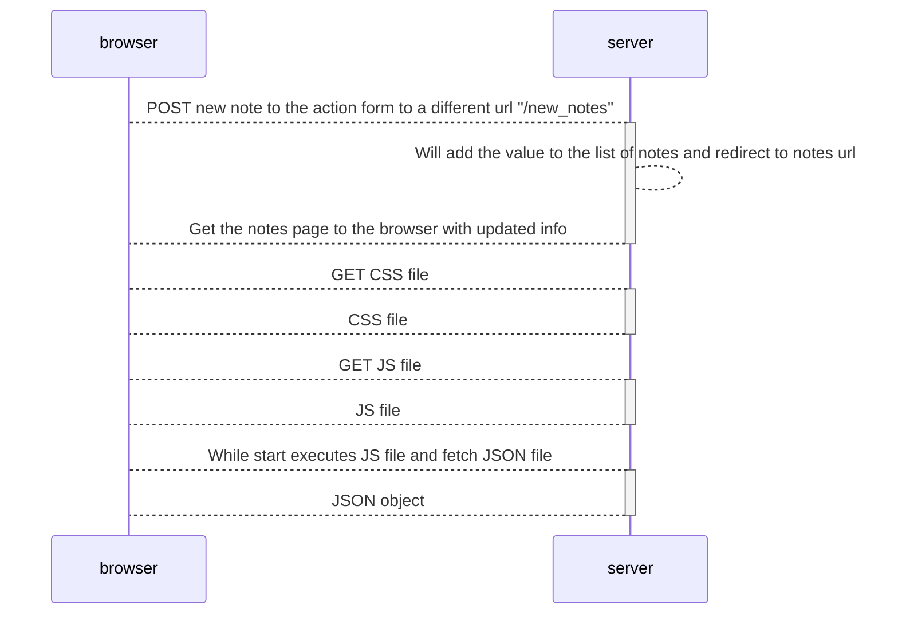

## Full stack developer certificate part 0 with exercise 4

```mermaid
sequenceDiagram
  participant browser
  participant server
  browser-->server: POST new note to the action form to a different url "/new_notes"
  activate server
  server-->server: Will add the value to the list of notes and redirect to notes url
  server-->browser: Get the notes page to the browser with updated info
  deactivate server
  
  browser-->server: GET CSS file 
  activate server
  server-->browser: CSS file
  deactivate server
  
  browser-->server: GET JS file
  activate server
  server-->browser: JS file
  deactivate server
  
  browser-->server: While start executes JS file and fetch JSON file
  activate server
  server-->browser: JSON object
  deactivate server
```
## Then browser executes the callback function which renders the notes
## There will be five HTTP requests in this process
