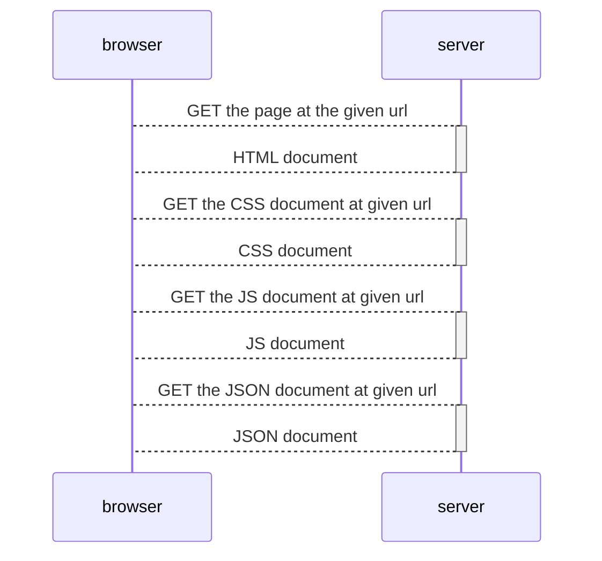

## Part 0 exercise 5

```mermaid
sequenceDiagram
  participant browser
  participant server
  browser-->server: GET the page at the given url
  activate server
  server-->browser: HTML document
  deactivate server
  
  browser-->server: GET the CSS document at given url
  activate server
  server-->browser: CSS document
  deactivate server
  
  browser-->server: GET the JS document at given url
  activate server
  server-->browser: JS document
  deactivate server
  
  browser-->server: GET the JSON document at given url
  activate server
  server-->browser: JSON document
  deactivate server
```
