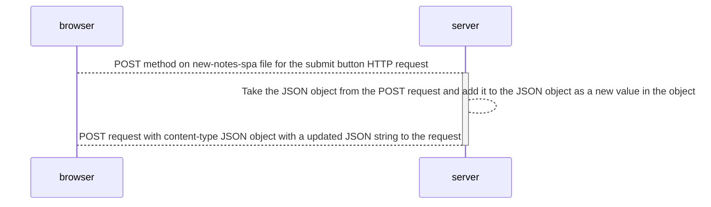

## Exercise 6
## What are the HTTP requests on behing adding new note to the list

```mermaid
sequenceDiagram
  participant browser
  participant server
  
  browser-->server: POST method on new-notes-spa file for the submit button HTTP request
  activate server
  server-->server: Take the JSON object from the POST request and add it to the JSON object as a new value in the object
  server-->browser: POST request with content-type JSON object with a updated JSON string to the request
  deactivate server
```
